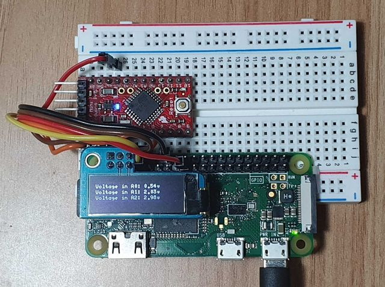

# Demo AVR+OLED+Chisel

An example of how to create a symbiosis beetween Nerves and Arduino using [AVR](https://github.com/luisgabrielroldan/avr).



## What is this?

This is a sample project that shows how an Arduino and a Nerves device can work together.

The Arduino Sketch and the Nerves code are in the same branch, and are compiled with `mix firmware`.

The compiled Arduino firmware travels with the Nerves firmware on the release. So you can update both devices remotely!

As last but not least the worker will comunicate with the firmware to read the Arduino Analog inputs.

## So this is to give analog input capabilities?

Not only that... this is to provide Nerves with real time support for certain sensors and other tasks tha are difficult to perform with soft-real-time.

# How to build
This project requires [arduino-mk](https://github.com/sudar/Arduino-Makefile).

Check the prequisites and Environment vars in [avr_companion_sample](https://github.com/luisgabrielroldan/avr_companion_sample).

You will need to set `ARDMK_VENDOR`, `AVR_TOOLS_DIR` and of course `MIX_TARGET`.

For Arch Linux I'm using:
```
export ARDMK_VENDOR=archlinux-arduino
export AVR_TOOLS_DIR=/usr
```
